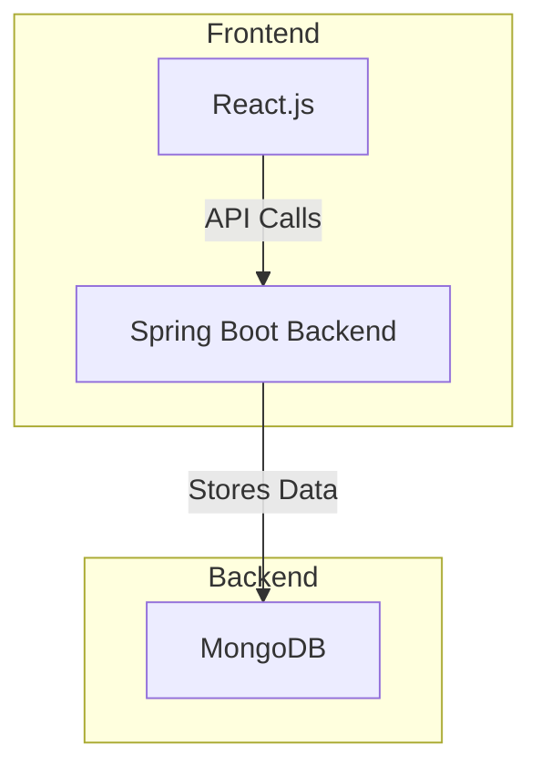

# 📌 Spring Boot Todo App

A simple **Todo App** built with **Spring Boot (Backend)**, **React.js (Frontend)**, **MongoDB (Database)**, and styled with **Tailwind CSS**. This application allows users to perform CRUD operations (Create, Read, Update, Delete) on their todos.

---

## 🏗️ Architecture



- **Frontend**: 🎨 React.js (User Interface)
- **Backend**: 🚀 Spring Boot (REST API)
- **Database**: 🛢️ MongoDB (NoSQL Storage)

---

## 📌 Features

✅ Add new todos  
✅ View all todos  
✅ Update todos  
✅ Delete todos  
✅ REST API with Spring Boot  
✅ Responsive UI using Tailwind CSS

---

## 🛠️ Technologies Used

| 🛠️ Tech Stack  | 🚀 Description |
|-------------|------------|
| Spring Boot | Backend Framework |
| React.js    | Frontend Library |
| MongoDB     | NoSQL Database |
| Tailwind CSS | Styling Framework |
| REST API    | Communication between Frontend & Backend |

---

## 🚀 Getting Started

### 🏗️ Prerequisites

- Java 17+
- Node.js & npm
- MongoDB installed locally or using MongoDB Atlas

### 🔥 Setup & Installation

#### Backend (Spring Boot)

1. Clone the repository:
   ```bash
   git clone https://github.com/yourusername/todo-app.git
   ```
2. Navigate to the backend folder:
   ```bash
   cd backend
   ```
3. Install dependencies and run the server:
   ```bash
   mvn spring-boot:run
   ```
4. Backend runs on `http://localhost:8080`

#### Frontend (React.js)

1. Navigate to the frontend folder:
   ```bash
   cd frontend
   ```
2. Install dependencies:
   ```bash
   npm install
   ```
3. Run React application:
   ```bash
   npm start
   ```
4. Open `http://localhost:3000` in the browser

---

## 📡 API Endpoints

| 🛠️ Method  | 🔗 Endpoint         | 📌 Description          |
|---------|-----------------|----------------------|
| GET     | `/todos`        | Get all todos       |
| POST    | `/todos`        | Add a new todo      |
| GET     | `/todos/{id}`   | Get todo by ID      |
| PUT     | `/todos/{id}`   | Update a todo       |
| DELETE  | `/todos/{id}`   | Delete a todo       |

---

 

## 🙌 Acknowledgements

Thanks to **Spring Boot**, **React.js**, and **MongoDB** communities for their amazing documentation and resources!

---

## 📩 Contact

👤 **Prathamesh Mane**  
📧 Email: your.email@example.com  
🔗 [GitHub](https://github.com/prathameshmane019)  
🔗 [LinkedIn](www.linkedin.com/in/prathamesh-mane-2308a5241)  

---

### 🎯 Happy Coding! 🚀

